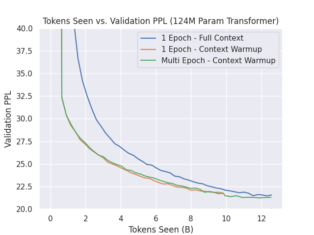

# How does Staged Sequence Training Interact with One Epoch Training?

Staged Sequence training involves initially training models with much shorter contexts at the beginning of training then increasing the context later in training (for example Shortformer begins training a model with contexts of 128 for 25% of the training steps and trains the rest at a context 3072 tokens). All the results I have seen for this type of training involve training models for multiple epochs. Bringing this approach to single epoch training raises two questions:

1. Do we still see the same benefits?
2. Can we reuse some of 'warmed' up sequences to further increase performance?

For question 2, during the warmup stage of training, we truncate the batches to reach the desired sequence length. In the case shown below, by utilizing a sequence warmup for 25% of the total training steps, we 'truncate out' almost 2.8B tokens! Could we retrain on these sequences at their full context and see further performance improvements?

## Background

We use the original OpenWebText (OWT) corpus and add in all components of the OpenWebText2 corpus that were scraped after the creation of OWT. Dataset is tokenized with GPT2's tokenizer. Final dataset statistics are:

```yaml
corpus: "openwebtext1+2"
tokenizer: "GPT2"
n_ctx: 1024
num_train_samples: 12574161
num_validation_samples: 806093
total_training_tokens: 12875940864 #~12.6B tokens
```


## Experiment Setup:

- All models are trained with a maximum context of 1024 tokens.
- Batch size of 512 is used during training
- Learning rate warmup over first 2000 batches from 0 to peak
- Learning rate decay follows cosine schedule to 10% of the peak over 90% of the remaining steps
- Final 10% of training steps are conducted at the final learning rate
- No dropout is used, only regularization comes from a weight decay of 0.1 applied to all non-bias and LN weights. 
- Initial Experiments are performed with the 'base' model listed under ```conf/model_config.yaml```. Model is approximately 124M params.

## Staged Sequence Training:

- When using contexts under 1024, all batches are truncated to the target context, keeping the number of sequences within a batch fixed. 
- Short sequence length is used over the first 25% of training (~6k steps). I experimented with a two-stage sequence warmup (128 -> 256) over the first 50% of training but models performed worse by about 1 PPL.
- Initial sequence length is set to 128 and is increased to 1024 after the target number of warmup steps has been reached.

## Experiments Performed:

1. (**Baseline**): One epoch training at maximum context. *Tokens seen during training: 12.6B*
2. (**Experiment 1**): One epoch training with staged sequence length warmup as described above. *Tokens seen during training: 9.9B*
3. (**Experiment 2**): Staged sequence length warmup + total training step count adjusted (~+5.25K steps) to hit equal number of training tokens as baseline model. *Tokens seen during training: 12.6B*

## Results:

## Baseline Model (124M Params)
All models were trained on a TPU V3-32 provided by Google's TPU Research Cloud (TRC). 

We compare final validation losses of all models:

| Model/Experiment | Validation PPL | Training Time (hrs) | Tokens Seen (B) |
|------------------|----------------|---------------------|-----------------|
| Baseline         | 21.599         | 6.75                | 12.6            |
| Experiment #1    | 21.801         | 6.00                | 9.9             |
| Experiment #2    | 21.156         | 7.50                | 12.6               |

Comparing the results between the baseline model and the experiment 1 models, shows that we can exchange a <1% performance decrease for an 11% speedup in overall training. In addition, we can extract extra performance at the cost of increased training time by training the models for additional steps to match the baseline number of training tokens. 

**Validation Losses versus Tokens Seen (B):**



Other questions to answer:
1. Do these results carry over to other tasks too? - Requires implementing greedy decoding for GPT module.


# Acknowledgements
TPU Development and training supported with Cloud TPUs from Google's TPU Research Cloud (TRC)
